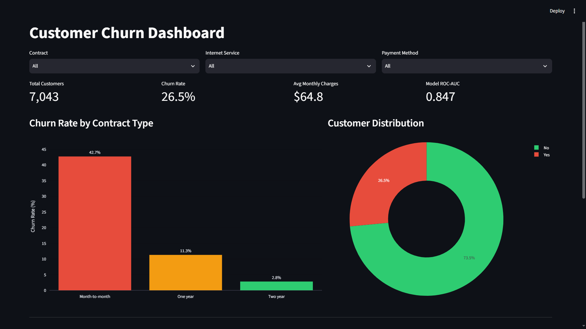
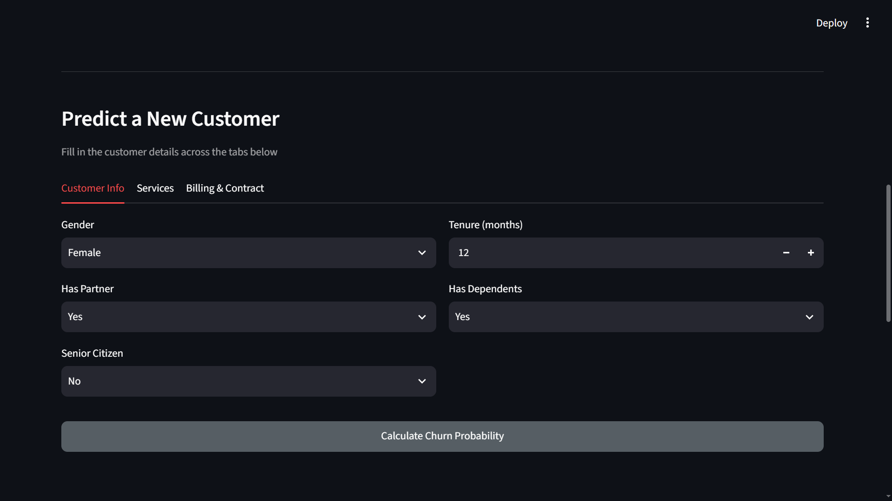
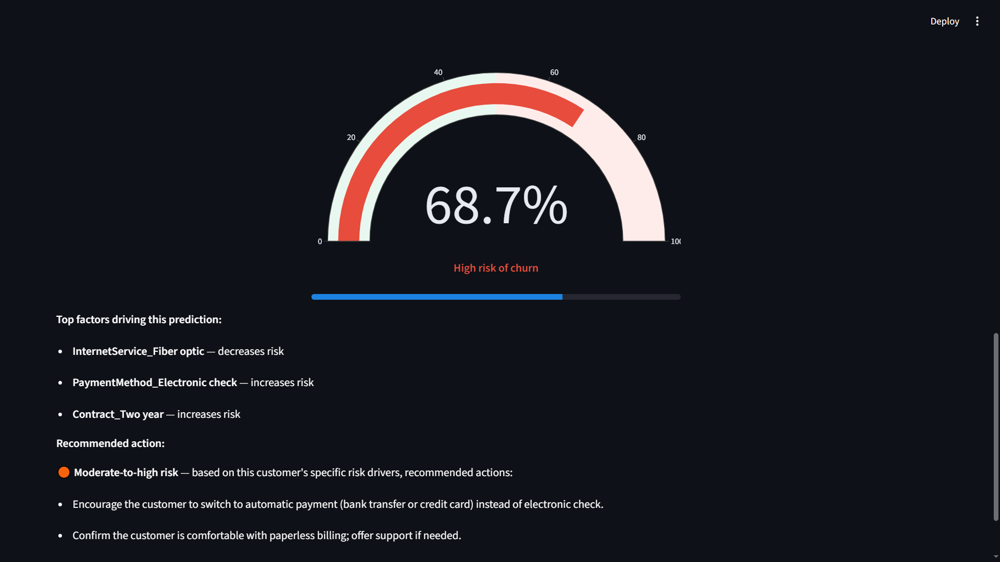
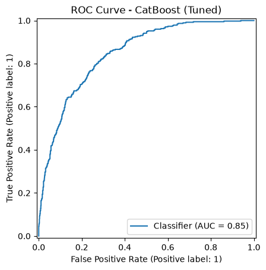
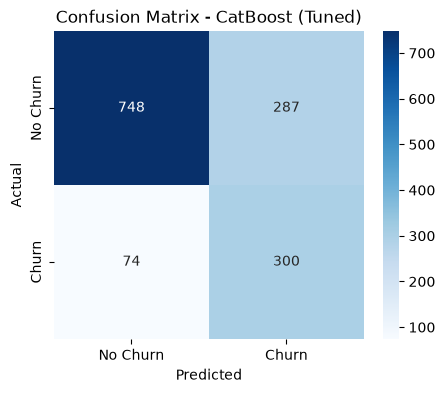
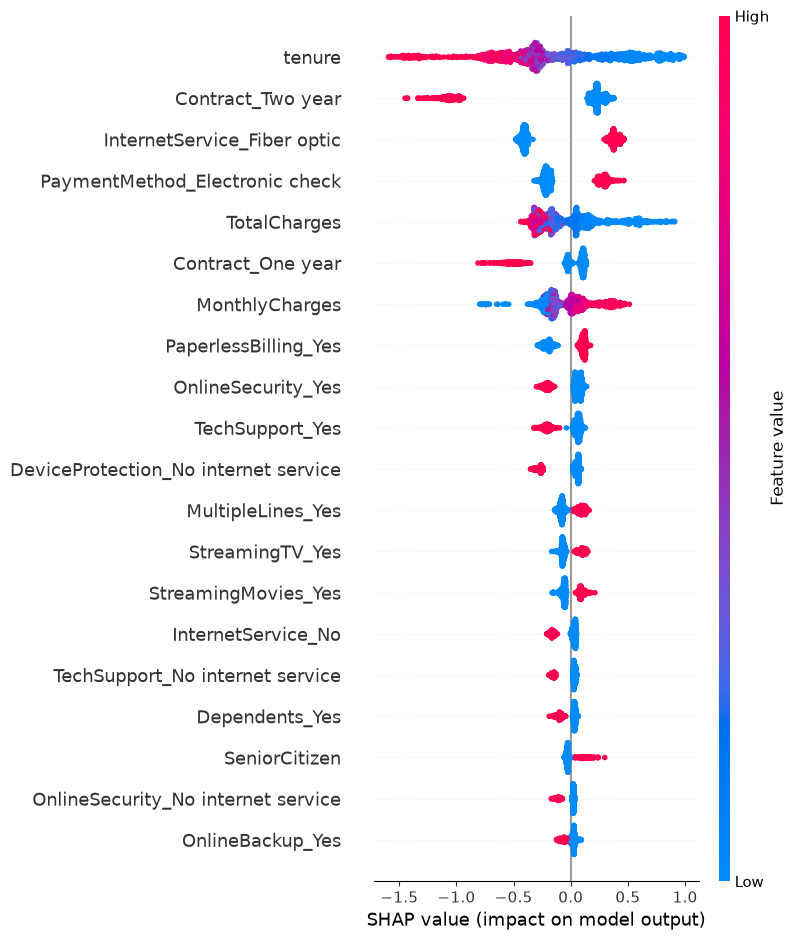
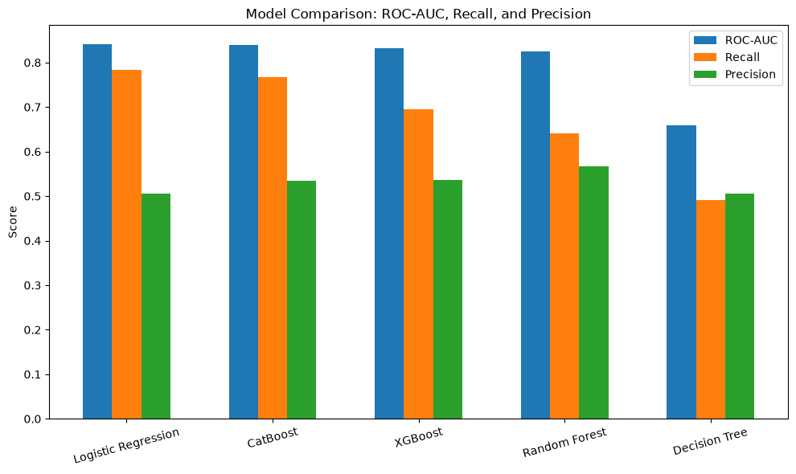

# Customer Churn Prediction & Retention Dashboard

An end-to-end machine learning project that predicts whether a telecom customer is likely to churn, explains *why* the model made that prediction using SHAP, and recommends a concrete retention action — all wrapped in an interactive Streamlit dashboard.

## Problem Statement

Customer churn is one of the biggest challenges for subscription-based businesses (telecom, SaaS, banking, insurance). Losing an existing customer costs far more than retaining one. This project builds a system that:

1. Predicts the probability that a given customer will churn
2. Explains which factors are driving that specific prediction
3. Recommends a targeted action to reduce that customer's churn risk

## Dataset

- **Source:** [IBM Telco Customer Churn (Kaggle)](https://www.kaggle.com/datasets/blastchar/telco-customer-churn)
- **Size:** 7,043 customers, 21 features (demographics, account info, services subscribed)
- **Target:** `Churn` (Yes/No) — 26.5% churn rate, 73.5% retained

## Project Pipeline

1. **Data Cleaning** — converted `TotalCharges` to numeric, identified and resolved 11 missing values (all new customers with `tenure = 0`), removed the `customerID` column
2. **Exploratory Data Analysis** — univariate, bivariate, and correlation analysis to understand churn drivers (e.g. churned customers have a median tenure of ~10 months vs ~38 months for retained customers)
3. **Feature Engineering** — one-hot encoding of categorical features, `StandardScaler` applied to numeric features
4. **Model Comparison** — trained and evaluated 5 classifiers: Logistic Regression, Decision Tree, Random Forest, XGBoost, CatBoost
5. **Class Imbalance Handling** — applied balanced class weights across all models, which raised average Recall substantially (e.g. Logistic Regression Recall improved from 0.56 to 0.78)
6. **Hyperparameter Tuning** — `RandomizedSearchCV` (5-fold CV) on the two strongest candidates
7. **Model Explainability** — SHAP (TreeExplainer) for both global feature importance and per-prediction explanations
8. **Interactive Dashboard** — Streamlit app with live filtering, KPIs, charts, and a prediction tool with SHAP-driven recommendations

## Results

| Model | Accuracy | Precision | Recall | F1-Score | ROC-AUC |
|---|---|---|---|---|---|
| **CatBoost (Tuned)** | **0.744** | **0.511** | **0.802** | **0.624** | **0.847** |
| Logistic Regression (Tuned) | 0.738 | 0.504 | 0.781 | 0.613 | 0.840 |

**CatBoost (Tuned)** was selected as the final model. Recall was prioritized over raw Accuracy, since in a churn context the cost of missing an at-risk customer outweighs the cost of a false alarm.

The top SHAP-ranked drivers of churn are **tenure**, **contract type** (two-year contracts strongly reduce risk), and **fiber optic internet service** (associated with higher risk).

## Dashboard Features

- Live filters by contract type, internet service, and payment method
- KPI cards: total customers, churn rate, average monthly charge, model ROC-AUC
- Churn rate by contract type (bar chart) and customer distribution (donut chart)
- **Predict a new customer**: fill in customer details across three tabs and get:
  - A churn probability gauge
  - The top 3 SHAP factors driving that specific prediction
  - A targeted recommendation (e.g. offer a discount, suggest a longer contract, switch payment method) generated from the actual risk drivers — not a generic rule

## Project Structure

```
Churn-Prediction/
├── data/
│   └── WA_Fn-UseC_-Telco-Customer-Churn.csv
├── notebooks/
│   ├── 01_churn_prediction.ipynb   # Cleaning, EDA, preprocessing, model comparison
│   └── 02_model_training.ipynb     # Hyperparameter tuning, SHAP
├── models/
│   ├── final_churn_model.pkl
│   ├── feature_columns.pkl
│   ├── scaler.pkl
│   ├── X_train.pkl / X_test.pkl / y_train.pkl / y_test.pkl
├── app.py                          # Streamlit dashboard
├── cleaned_churn_data.csv
├── requirements.txt
└── README.md
```

## Tech Stack

Python · Pandas · NumPy · Scikit-learn · XGBoost · CatBoost · SHAP · Streamlit · Plotly · Matplotlib · Seaborn

## Running the Project

```bash
# 1. Install dependencies
pip install -r requirements.txt

# 2. (Optional) Re-run the notebooks to regenerate the model artifacts
#    Open notebooks/01_churn_prediction.ipynb and notebooks/02_model_training.ipynb

# 3. Launch the dashboard
streamlit run app.py
```

## Screenshots












** Menna Mohamed**
